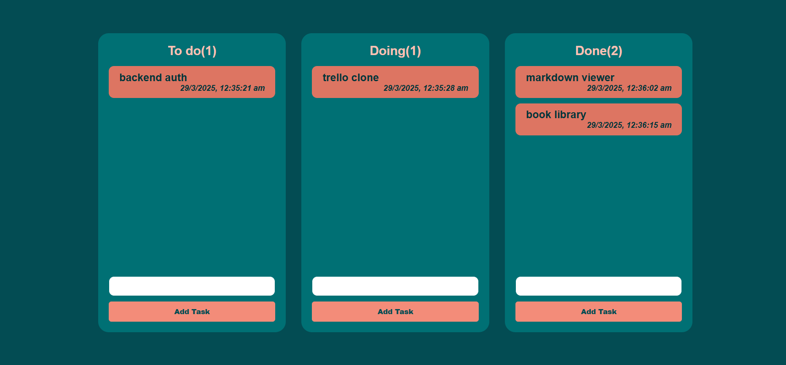

# Feature -
- You can add task in different coulumns named as To do ,Doing ,Done
- You can delete task from the list
- You can edit task from the list
- You can drag and drop task from one column to another column
- Tasks have time and date stamp when they are created.
- Coloumn name have count of tasks in the coloumn
- Data is stored in Local Storage . Resulting in data not getting lost after refresh.
- You can sort tasks by sorting 

## Site view 

### Deployment Link
